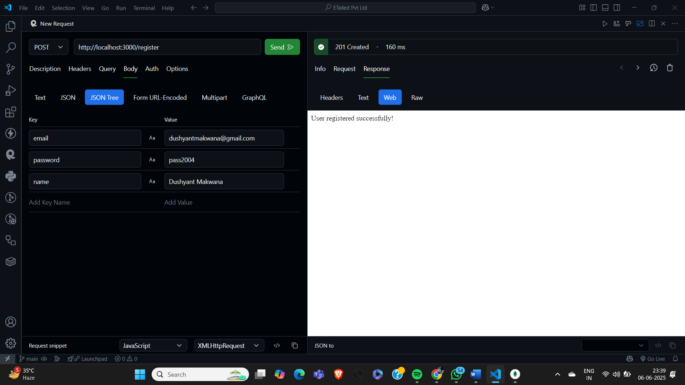
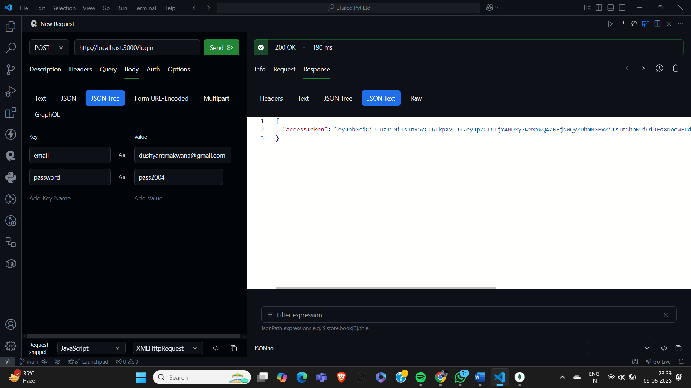
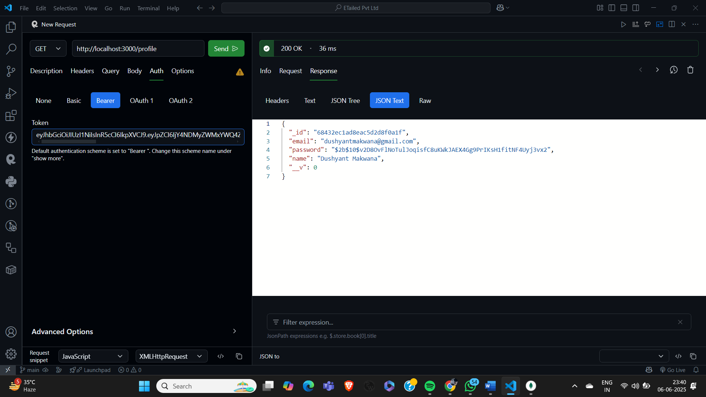
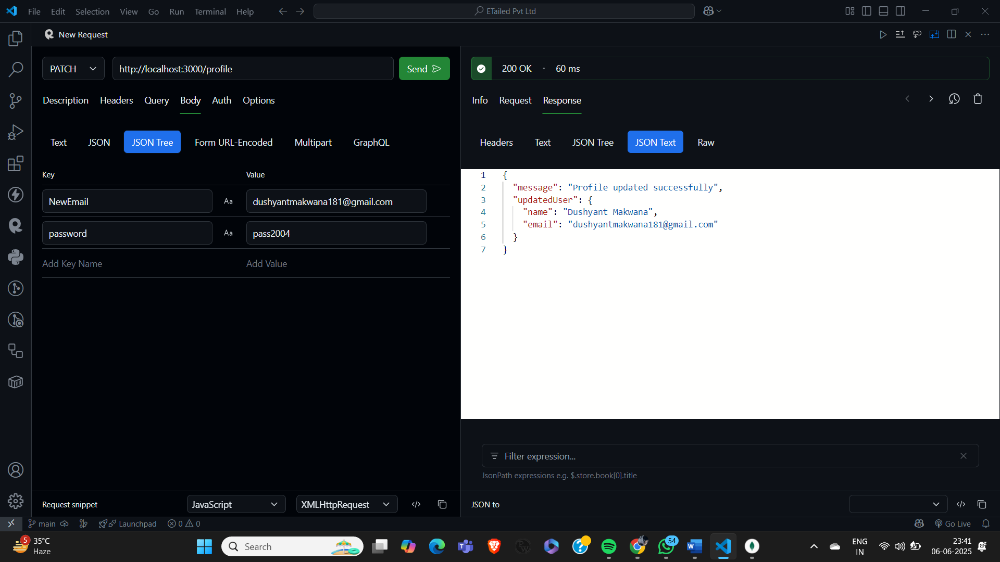
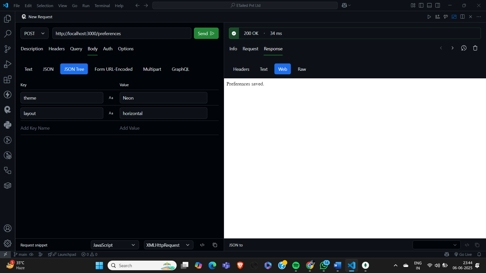
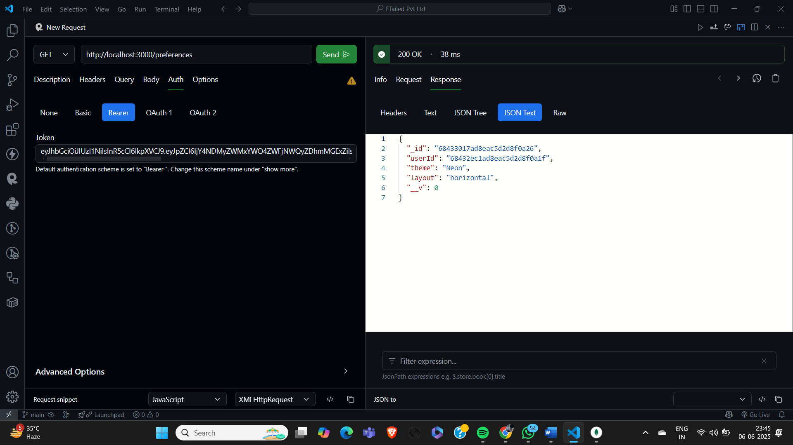
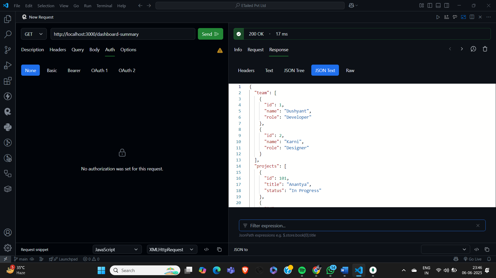
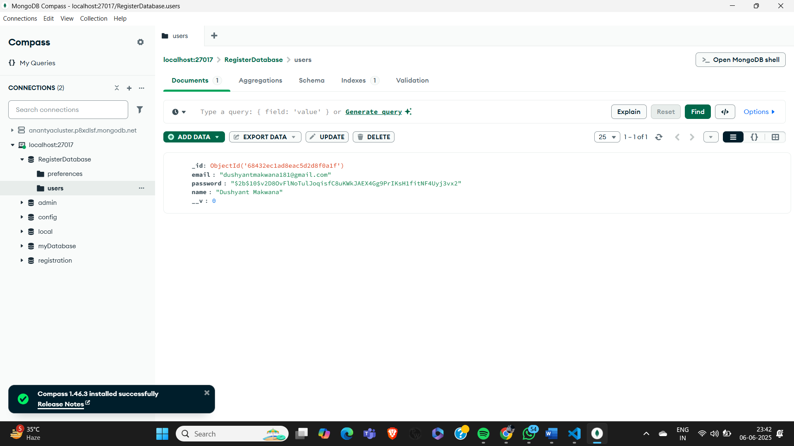

---

# 🧪 Backend Intern Assignment 

 The project is built with **Node.js**, **Express**, and **MongoDB**, with **JWT** for authentication and **bcrypt** for password hashing.

---

## 🔧 Tech Stack

* **Node.js**
* **Express**
* **MongoDB** or **PostgreSQL**
* **JWT** for authentication
* **bcrypt** for hashing passwords
* **custom** input validation
* **dotenv** for environment variables

---

## 🚀 Getting Started

### 1. Clone the repository

```bash
git clone https://github.com/dushyantmak85/ETailed-Pvt-Ltd-Backend-Developer-Assignment
cd ETailed-Pvt-Ltd-Backend-Developer-Assignment
```

### 2. Install dependencies

```bash
npm install
```


```env
PORT=3000
ACCESS_TOKEN_SECRET=mysecret123
```

### 4. Start the server

```bash
npm start
```

The server will run at: `http://localhost:3000`

---

## 📁 Folder Structure

```
├── models/
│   └── UserModel.js
│   └── PreferencesModel.js
├── routes/
│   └── login.js
│   └── preferences.js
│   └── Updateprofile.js
│   └── dashboard-summary.js
|   └── register.js
├── middleware/
│   └── AuthenticateToken.js
├── .env
├── server.js
├── package-lock.json
├── package.json
├── .gitignore
```

---

## 📌 API Endpoints

### 1. **User Authentication**

| Method | Route                            | Description                                 |
| ------ | -------------------------------- | ------------------------------------------- |
| POST   | `http://localhost:3000/register` | Register a new user (email, name, password) |
| POST   | `http://localhost:3000/login`    | Login user and return JWT token             |
| GET    | `http://localhost:3000/profile`  | ✅ Protected - Returns user details         |

---

### 2. **Preferences API**

| Method | Route                               | Description                     |
| ------ | ----------------------------------- | ------------------------------- |
| POST   | `http://localhost:3000/preferences` | Save theme and dashboard layout |
| GET    | `http://localhost:3000/preferences` | Return saved preferences        |

🔐 *Linked to user ID from JWT.*

---

### 3. **Bonus Endpoints**

| Method | Route                                     | Description                                        |
| ------ | ----------------------------------------- | -------------------------------------------------- |
| GET    | `http://localhost:3000/dashboard-summary` | Returns dummy data (team, projects, notifications) |
| PATCH  | `http://localhost:3000/profile`           | Update user name or email                          |

---

## ✅ Features & Best Practices

* 🔐 JWT-based protected routes
* 🔒 Passwords securely hashed using bcrypt
* 📦 Modular structure with routes and models
* 🌱 Uses `.env` for sensitive configurations
* ✅ Input validation using  custom methods

---

## 🧪 Example Usage

### Register

```http
POST http://localhost:3000/register
Content-Type: application/json
{
  "email": "user@example.com",
  "name": "Dushyant",
  "password": "securePassword123"
}
```

### Login

```http
POST http://localhost:3000/login
{
  "email": "user@example.com",
  "password": "securePassword123"
}
```

Returns:

```json
{ "token": "your.jwt.token" }
```

Use this token in Authorization header as:

```
Authorization: Bearer your.jwt.token
```
Great! Here's how you can structure your `README.md` to include **multiple screenshots with captions** showing different parts of your app:

---

## 📸 Screenshots

### ✅ 1. Registering a New User

Shows the `/register` endpoint in RapidAPI CLient with a success response.



---


### 🔐 2. Logging In a User

Shows the `/login` endpoint returning a JWT token.



---

### 👤 3. Accessing a Protected Profile

Shows `/profile` being accessed with the JWT token in the Authorization header.



---

### 👤 3. Updating Profile Info

Shows `/profile` being updated with the JWT token in the Authorization header.



---


### 🎨 4. Saving User Preferences

Shows the `/preferences` POST request saving theme and layout.



---

### 🎨 4. Accessing User Preferences

Shows the `/preferences` GET request to access saved theme and layout with jwt token.



---

### 📊 5. Fetching Dashboard Summary

Shows the `/dashboard-summary` endpoint returning dummy team/project/notification data.



---

## 📝 MongoDB Database



---


---

## 📬 Contact

Feel free to connect with me if you have any questions!

**Dushyant Makwana**

---

